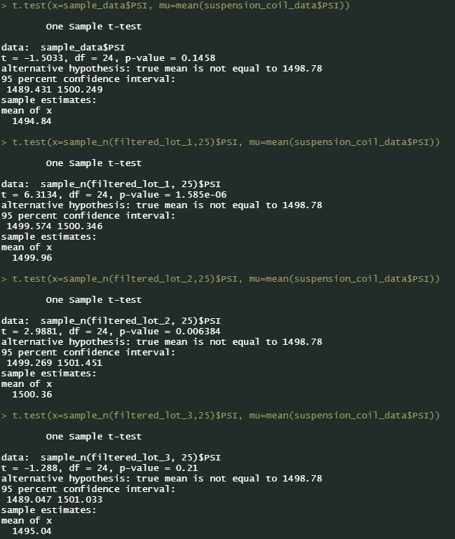

# Car Manufacturer Statistical Analysis
 
### Linear Regression to Predict MPG

These are questions I am trying to answer based on the given set of data:

>- Which variables/coefficients provided a non-random amount of variance to the mpg values in the dataset?
>- Is the slope of the linear model considered to be zero? Why or why not?
>- Does this linear model predict miles per gallon (MPG) of MechaCar prototypes effectively? Why or why not?

- The coefficients that provided a non-random amount of variance to the MPG values in the dataset were: vehicle_length, vehicle_weight, and ground_clearance. I used the significance codes key to determine how impactful each coefficient was. 
- Looking at the linear regression summary statistics, the p-value is 5.35e-11, which is much smaller than our assumed significane level of 0.05%. Because of this, there is sufficient evidence to where I can reject the null hypothesis, meaning that the slope of our linear model is not zero.
- The multiple R-squared value from these statistics is 0.7149. This means that 71.49% of the variability of the dependent variable can be explained using this linear model.

### Summary Statistics on Suspension Coils

>"The design specifications for the suspension coils dictate that the variance of the suspension coils must not exceed 100 pounds per square inch. Does the current manufacturing data meet this design specification for all manufacturing lots in total and each lot individually? Why or why not?"

The current manufacturing data does not meet this design specification for all manufacturing lots in total, but it does for some lots individually. In the image of the summary statistics of the Suspension Coil Data, grouped by Lot, we will look at the variance statistic.
- Lot 1 has a variance of 0.9795918, so this passes the design specifications
- Lot 2 has a variance of 7.4693878, so this passes the design specifications
- Lot 3 has a variance of 170.2861224, this does not pass design specifications as it exceeds 100 PSI

### T-Tests on Suspension Coils

The image above shows the four different t-tests conducted on the Suspension Coil Data:
1. a test of a sample of all lots against the mean of the population
   - significance level = 0.05
   - p-value = 0.1458
   - p-value > significance level, therefore we do not have sufficient evidence to reject the null hypothesis
2. a test of a sample of lot 1 against the mean of the population
   - significance level = 0.05
   - p-value = 1.585e-06 (.000001585)
   - p-value < significance level, therefore we have sufficient evidence to reject the null hypothesis
3. a test of a sample of lot 2 against the mean of the population
   - signficance level = 0.05
   - p-value = 0.006384
   - p-value < significance level, therefore we have sufficient evidence to reject the null hypothesis
4. a test of a sample of lot 3 against the mean of the population
   - significance level = 0.05
   - p-value = 0.21
   - p-value > significance level, therefore we do not have sufficient evidence to reject the null hypothesis

### Study Design: Car Manufacturer vs Competition

The design of this analysis could serve as the base for another analysis of a different company, and could lead to larger, more comprehensive analyses of the two (or more) companies in the future. I am interested in the metrics of cost, horsepower, weight, ground clearance, city/highway MPG. My null hypothesis is that these variables together impact the overall fuel efficiency of the car. I would perform a multiple linear regression test of these metrics against city/highway MPG to determine this because individually, these are all independent variables while the car's fuel efficiency is the dependent variable. To perform this analysis, I would need data from cars made from both automakers that include these metrics.
