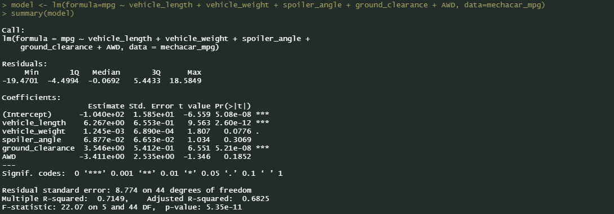
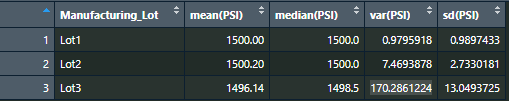

# Module 15 Challenge
## Deliverable 1
 
### Linear Regression to Predict MPG

From Deliverable 1,
>
- Which variables/coefficients provided a non-random amount of variance to the mpg values in the dataset?
- Is the slope of the linear model considered to be zero? Why or why not?
- Does this linear model predict mpg of MechaCar prototypes effectively? Why or why not?

- The coefficients that provided a non-random amount of variance to the MPG values in the dataset were: vehicle_length, vehicle_weight, and ground_clearance. I used the significance codes key to determine how impactful each coefficient was. 
- Looking at the linear regression summary statistics, the p-value is 5.35e-11, which is much smaller than our assumed significane level of 0.05%. Because of this, there is sufficient evidence to where I can reject the null hypothesis, meaning that the slope of our linear model is not zero.
- The multiple R-squared value from these statistics is 0.7149. This means that 71.49% of the variability of the dependent variable can be explained using this linear model.

## Deliverable 2

### Summary Statistics on Suspension Coils
From Deliverable 2,
>"The design specifications for the MechaCar suspension coils dictate that the variance of the suspension coils must not exceed 100 pounds per square inch. Does the current manufacturing data meet this design specification for all manufacturing lots in total and each lot individually? Why or why not?"

The current manufacturing data does not meet this design specification for all manufacturing lots in total, but it does for some lots individually. In the image of the summary statistics of the Suspension Coil Data, grouped by Lot, we will look at the variance statistic.
- Lot 1 has a variance of 0.9795918, so this passes the design specifications
- Lot 2 has a variance of 7.4693878, so this passes the design specifications
- Lot 3 has a variance of 170.2861224, this does not pass design specifications as it exceeds 100 PSI